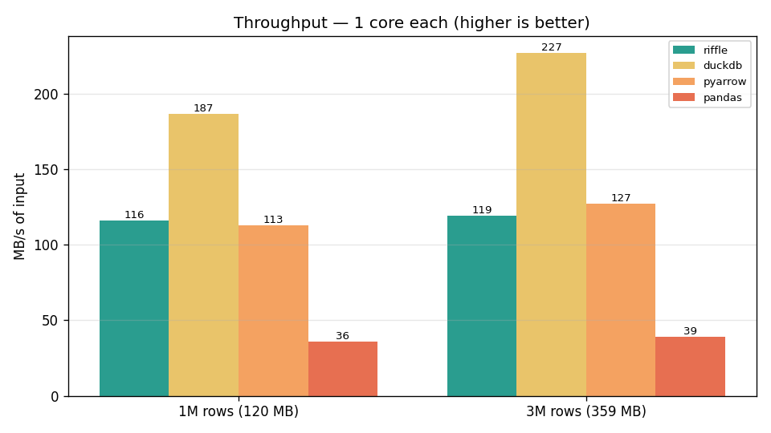
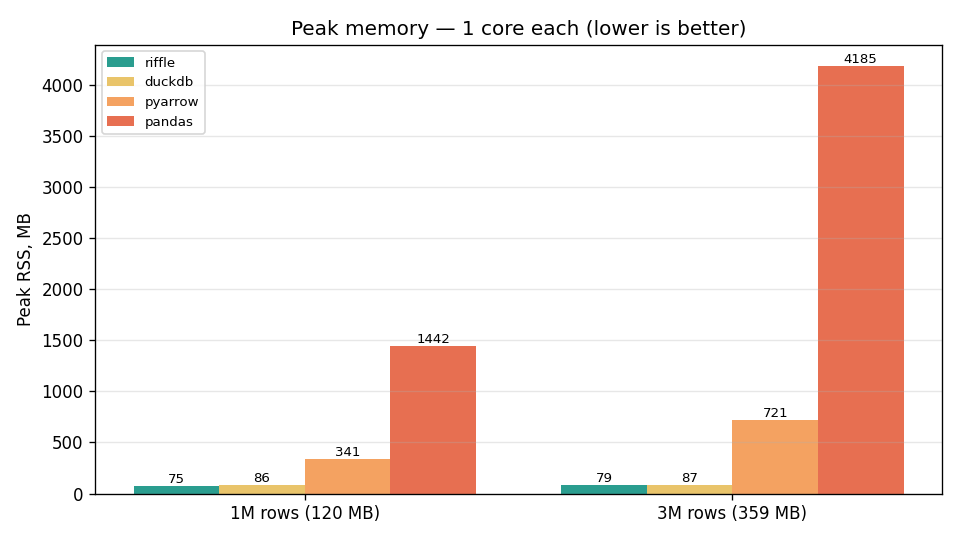
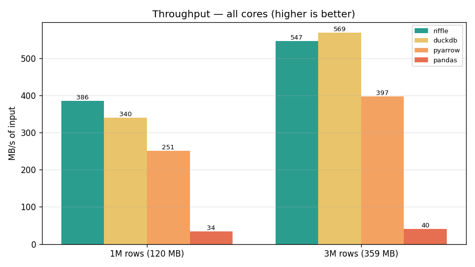
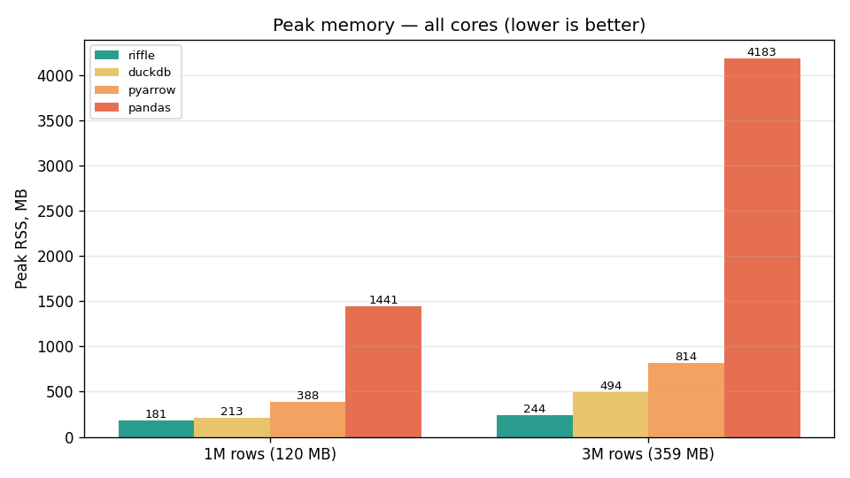

# Riffle

**🇬🇧 English** · [🇷🇺 Русский](README.ru.md)

> Streaming **JSON-lines → Parquet** converter for huge logs — built in C++, fast, and
> memory-bounded.

`riffle` turns terabyte-scale `.jsonl` files into analytics-ready **Apache Parquet** on a
single machine, at disk speed, **without loading the input into RAM**. It fills the gap
between "grep the log by hand" and "spin up Spark/pandas/DuckDB for one conversion".

---

## Why Riffle

- **Bounded memory** — one-pass streaming with bounded batches; RAM usage does **not** grow with
  the size of the file. This is the headline feature: convert files **larger than RAM**.
  Single-threaded peak is ~80 MB flat; `--threads` adds a small, bounded amount per worker.
- **Scales with cores** — SIMD JSON parsing ([simdjson](https://github.com/simdjson/simdjson)) and
  batched columnar appends sustain ~115 MB/s on one core and **~410–550 MB/s with `--threads 8`** —
  matching or beating DuckDB/PyArrow on the bench machine — with **deterministic, byte-identical**
  output regardless of thread count.
- **Zero-config schema** — the column schema is **inferred** (including ISO-8601 timestamps), with
  an optional `--schema` override and column projection (`--select`/`--exclude`/`--rename`).
- **Handles real inputs** — transparent **gzip/zstd** decompression by extension, and nested JSON
  either flattened to dotted columns or mapped to **native Parquet struct/list** (`--nested native`).
- **One static binary** — no Python/JVM runtime; usable as a CLI or a C++ library. Builds and is
  tested on Linux, macOS and Windows.

See the full design in [`docs/riffle.md`](docs/riffle.md).

## Who it's for

- **Data / backend engineers** who need JSON logs in a columnar store for analytics, without
  standing up Spark or a Python data stack.
- **DevOps / SRE** turning application, access or audit logs (`.jsonl`) into Parquet to query
  with DuckDB, Spark, Trino/Athena, or pandas.
- **Anyone on a laptop or small VM** who must convert a file **larger than available RAM** —
  Riffle's flat memory footprint is exactly for this.
- **Pipeline / container authors** who prefer a single dependency-free binary over a
  Python/JVM runtime in an ETL step.

## Use cases

- **Log archival & analytics** — convert NDJSON application/access/audit logs to compact
  Parquet for cheap columnar storage and fast queries.
- **ETL ingestion stage** — a fast, memory-bounded "JSON-lines → Parquet" step inside a larger
  pipeline (cron job, Airflow task, container step).
- **Data-lake landing** — normalize heterogeneous JSON events into typed Parquet with an
  inferred schema (or a pinned `--schema`).
- **Ad-hoc conversion** — turn a huge one-off `.jsonl` dump into Parquet on a laptop where
  pandas/pyarrow would run out of memory.
- **Compressed logs** — point Riffle straight at `big.jsonl.gz`/`big.jsonl.zst` (decompressed
  transparently), or stream from a pipe with `-` as the input.
- **As a library** — embed `riffle::convert` in a C++ service to emit Parquet from JSON without
  pulling in a heavy data framework.

## Benchmarks

Riffle vs. the common Python one-liners (`duckdb`, `pyarrow.json`, `pandas`), converting the same
JSON-lines dataset to Parquet. Every tool is measured **twice** — **single-threaded** (one core
each) and **multi-threaded** (all cores) — for a like-for-like comparison; reproduce with
`just bench` (each tool 3×, best wall-time, peak RSS polled via psutil). DuckDB is pinned with
`SET threads`, PyArrow via `ReadOptions(use_threads)`, Riffle via `--threads`; pandas has no
parallel JSON reader, so it appears single-threaded in both.

### Single-threaded — one core each




Per core, DuckDB leads on speed (~190–230 MB/s); Riffle (~115–120 MB/s) is on par with PyArrow.
Riffle's edge here is **memory**: ~75–80 MB regardless of input, while PyArrow balloons to
340 MB / 720 MB and pandas to 1.4 GB / 4.2 GB (DuckDB is also lean, ~87 MB).

| Tool (1 core) | Throughput 1M | Throughput 3M | Peak mem 1M | Peak mem 3M |
| ------------- | ------------- | ------------- | ----------- | ----------- |
| **riffle**    | 116 MB/s      | 119 MB/s      | **75 MB**   | **79 MB**   |
| duckdb        | **187 MB/s**  | **227 MB/s**  | 87 MB       | 87 MB       |
| pyarrow       | 113 MB/s      | 127 MB/s      | 341 MB      | 721 MB      |
| pandas        | 36 MB/s       | 39 MB/s       | 1442 MB     | 4185 MB     |

### Multi-threaded — all cores




With all cores Riffle (`--threads 8`) is **the fastest on the 1M set** (386 vs DuckDB 340,
PyArrow 251) and **neck-and-neck with DuckDB on 3M** (547 vs 569), well ahead of PyArrow — and it
does so in the **least memory of the fast tools** (~180–245 MB vs DuckDB's 213–494 and PyArrow's
388–814), still bounded so it never grows with input size.

| Tool (all cores)            | Throughput 1M | Throughput 3M | Peak mem 1M | Peak mem 3M |
| --------------------------- | ------------- | ------------- | ----------- | ----------- |
| **riffle** (`--threads 8`)  | **386 MB/s**  | 547 MB/s      | **181 MB**  | **244 MB**  |
| duckdb                      | 340 MB/s      | **569 MB/s**  | 213 MB      | 494 MB      |
| pyarrow                     | 251 MB/s      | 397 MB/s      | 388 MB      | 814 MB      |
| pandas                      | 34 MB/s       | 40 MB/s       | 1441 MB     | 4183 MB     |

### Scaling with `--threads`


Throughput scales with cores: **~117 → 205 → 308 → 369 MB/s** at 1 → 2 → 4 → 8 threads on the
120 MB dataset. Output is **byte-identical and deterministic** regardless of thread count (workers
parse+build chunks; a single writer emits batches in input order). The cost is memory: each extra
in-flight chunk adds a bounded amount, so peak RSS grows modestly with `--threads` but never with
input size.

**Bottom line:** per core, DuckDB and PyArrow parse JSON faster than Riffle. But with `--threads`
Riffle **matches or beats them on throughput** while being the only tool that stays in **bounded
memory** — and it ships as a single dependency-free binary. DuckDB remains excellent for in-memory
SQL analytics; for converting **arbitrarily large logs to Parquet with predictable memory** (in one
thread for the smallest footprint, or many for top speed), Riffle is purpose-built.

## Status

🚧 **Working MVP.** JSON-lines → Parquet (and `columnar-raw`) conversion works end-to-end
(library + CLI), built test-first with 100+ tests. C++23. Schema is inferred (including ISO-8601
timestamps); column types auto-widen beyond the inference sample. Supported: `--schema` JSON
override, column projection (`--select`/`--exclude`/`--rename`), transparent gzip/zstd input,
multi-threaded conversion (`--threads`, deterministic output), and nested JSON either flattened
to dotted columns (default) or mapped to **native Parquet struct/list** (`--nested native`).
Known limitation: with `--threads > 1` the schema is fixed from the inference sample (no
cross-batch widening).

## Quick start

CI builds and tests on **Linux, macOS, and Windows** (every push and PR). Tagged releases attach
**prebuilt binaries** for each platform (`riffle-linux-x86_64.tar.gz`, `riffle-macos-arm64.tar.gz`,
`riffle-windows-x86_64.zip`) on the [Releases](https://github.com/GoonerTim/riffle/releases) page —
these are dynamically linked against Arrow, so install the Arrow runtime (below) to run them, or
build from source.

### Install

```bash
# Debian/Ubuntu: Arrow/Parquet come from the Apache Arrow APT repository,
# not the stock Ubuntu repos.
sudo apt-get update
sudo apt-get install -y -V ca-certificates lsb-release wget
wget https://apache.jfrog.io/artifactory/arrow/$(lsb_release --id --short | tr 'A-Z' 'a-z')/apache-arrow-apt-source-latest-$(lsb_release --codename --short).deb
sudo apt-get install -y -V ./apache-arrow-apt-source-latest-$(lsb_release --codename --short).deb
sudo apt-get update

# Build dependencies
sudo apt-get install -y -V \
    build-essential cmake ninja-build \
    libarrow-dev libparquet-dev libzstd-dev libsnappy-dev \
    libgtest-dev

# Build
cmake -S . -B build -G Ninja -DCMAKE_BUILD_TYPE=Release
cmake --build build -j
```

On **macOS** (Homebrew) and **Windows** (MSYS2 UCRT64) the dependencies come from the platform
package manager; the build command is identical:

```bash
# macOS
brew install apache-arrow cmake ninja googletest

# Windows — in an MSYS2 UCRT64 shell
pacman -S --needed mingw-w64-ucrt-x86_64-{gcc,cmake,ninja,arrow,gtest}
```

To build just the CLI without the test suite (no GoogleTest needed), add
`-DRIFFLE_BUILD_TESTS=OFF`.

### Use

```bash
# File -> Parquet (schema inferred automatically)
riffle events.jsonl -o events.parquet

# Gzip/zstd input is decompressed transparently (by extension)
riffle huge.jsonl.gz -o out.parquet

# Parallel conversion across cores (deterministic output, bounded memory)
riffle huge.jsonl -o out.parquet --threads 8

# Map nested JSON to native Parquet struct/list instead of flattening
riffle events.jsonl -o out.parquet --nested native

# Multiple files via glob + explicit schema override
riffle 'logs/*.jsonl' -o merged.parquet --schema schema.json

# Keep going on bad lines, collect them, print stats to stderr
riffle events.jsonl -o out.parquet --on-error collect --stats
```

### Library

```cpp
#include <riffle.hpp>

int main() {
    // make_Config validates invariants and throws std::invalid_argument on bad input.
    riffle::Config cfg = riffle::make_Config({
        .inputs = {"events.jsonl"},
        .output_path = "events.parquet",
        .threads = 8,
    });
    riffle::ConvertStats stats = riffle::convert(cfg);
    return stats.final_state == riffle::PipelineState::DONE ? 0 : 1;
}
```

## CLI flags

| Flag                | Argument                       | Default   | Effect                                  |
| ------------------- | ------------------------------ | --------- | --------------------------------------- |
| `-o, --output`      | path                           | required  | Output file                             |
| `--format`          | `parquet` \| `columnar-raw`    | `parquet` | Output format                           |
| `--schema`          | path to JSON                   | none      | Explicit schema, overrides inference    |
| `--compression`     | `none` \| `snappy` \| `zstd`   | `zstd`    | Parquet codec                           |
| `--batch-rows`      | integer                        | `65536`   | Rows per batch                          |
| `--batch-bytes`     | integer                        | 256 MiB   | Byte cap per batch                      |
| `--threads`         | integer                        | `1`       | Parallel worker threads                 |
| `--on-error`        | `skip` \| `abort` \| `collect` | `skip`    | Policy for malformed lines              |
| `--type-conflict`   | `widen` \| `string` \| `error` | `widen`   | Column type-conflict resolution         |
| `--nested`          | `flatten` \| `native`          | `flatten` | Flatten nested JSON or map to Parquet struct/list |
| `--select`          | `col,col,...`                  | all       | Keep only these columns (in this order) |
| `--exclude`         | `col,col,...`                  | none      | Drop these columns                      |
| `--rename`          | `from=to,...`                  | none      | Rename output columns                   |
| `--print-schema`    | —                              | off       | Print the inferred schema as JSON, then exit |
| `--stats`           | —                              | off       | Print conversion stats to stderr        |
| `-h, --help`        | —                              | —         | Show help and exit                      |
| `--version`         | —                              | —         | Show version and exit                   |

## Development

This repo uses [`just`](https://github.com/casey/just) as a task runner:

```bash
just            # list tasks
just build      # configure + build (Release)
just test       # run the test suite
just fmt        # format sources (clang-format)
just lint       # static analysis (clang-tidy)
```

CI builds and tests on **Linux, macOS and Windows** and runs format + clang-tidy checks on every
push and pull request; tagged releases build per-platform binaries (see
[`.github/workflows/`](.github/workflows/)).

## Contributing

Contributions are welcome — see [CONTRIBUTING.md](CONTRIBUTING.md)
([на русском](CONTRIBUTING.ru.md)).

## License

[MIT](LICENSE) © 2026 Riffle contributors.
