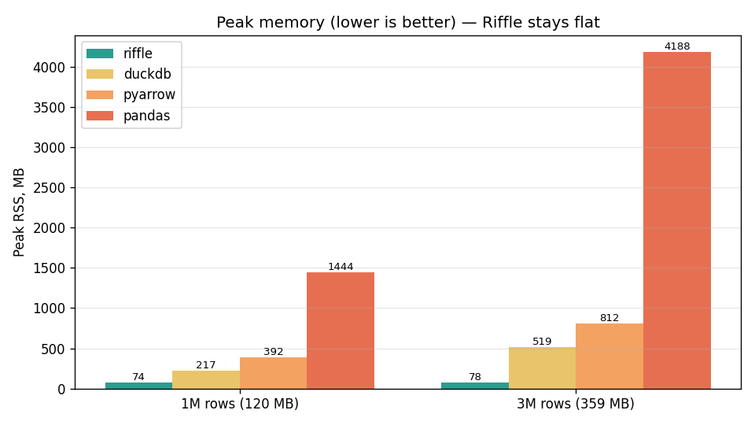
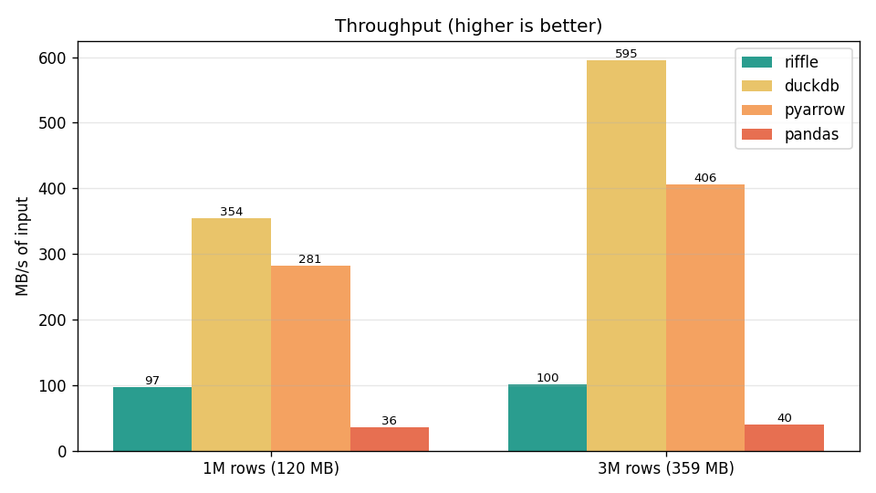

# Riffle

**🇬🇧 English** · [🇷🇺 Русский](README.ru.md)

> Streaming **JSON-lines → Parquet** converter for huge logs — built in C++, fast, and
> memory-bounded.

`riffle` turns terabyte-scale `.jsonl` files into analytics-ready **Apache Parquet** on a
single machine, at disk speed, **without loading the input into RAM**. It fills the gap
between "grep the log by hand" and "spin up Spark/pandas/DuckDB for one conversion".

The name is a double metaphor: a *riffle* is both a quick shuffle of a card deck
(restructuring rows into columns) and water running over stones (streaming).

---

## Why Riffle

- **Throughput first** — SIMD JSON parsing ([simdjson](https://github.com/simdjson/simdjson))
  and columnar batching target on the order of **≥ 1 GB/s** on a single core.
- **Constant memory** — one-pass streaming with bounded batches; RAM usage is **O(1)** in the
  size of the input, not the size of the file.
- **Zero-config** — the column schema is **inferred** from the data, with an optional explicit
  `--schema` override when inference guesses wrong.
- **One static binary** — no Python/JVM runtime. Drops cleanly into pipelines and containers.

See the full design in [`docs/riffle.md`](docs/riffle.md).

## Benchmarks

Converting the same JSON-lines dataset to Parquet, Riffle vs. the common Python one-liners
(`duckdb`, `pyarrow.json`, `pandas`). Measured on the development machine; reproduce with
`just bench` (each tool run as a subprocess 3×, best wall-time, peak RSS polled via psutil).

### Peak memory — the reason Riffle exists



Riffle streams in **constant memory**: its peak stays at **~80 MB whether the input is 120 MB
or 359 MB**. The others load the whole file (or large intermediates): pandas peaks at **4.2 GB
on a 359 MB input (~12×)**, pyarrow at ~810 MB, duckdb at ~490 MB and growing with input size.
That flat line is why Riffle converts files **larger than RAM** on a laptop where the others OOM.

### Throughput — honest picture



Riffle is **not** the throughput leader. DuckDB (~350–595 MB/s) and PyArrow (~280–405 MB/s) are
faster; Riffle sustains **~100 MB/s**, ahead of pandas (~40 MB/s). Parsing uses the simdjson
**on-demand** API, fields are written **straight into column builders** (no intermediate row
object, no per-field path allocation), and Arrow appends are **batched** per column. The
remaining cost is Arrow array construction and per-line reading; compression codec barely moves it.

### Where Riffle wins / where it doesn't

| Criterion                          | Riffle                | duckdb | pyarrow | pandas |
| ---------------------------------- | --------------------- | ------ | ------- | ------ |
| Peak memory, flat with input size  | ✅ ~80 MB, constant    | ⚠️ grows | ❌ grows | ❌ huge |
| Converts files larger than RAM     | ✅                     | ⚠️      | ❌       | ❌      |
| Raw throughput                     | ⚠️ ~80 MB/s            | ✅      | ✅       | ❌      |
| Single static binary, no runtime   | ✅                     | ❌ (lib) | ❌ (lib) | ❌ (lib) |

**Bottom line:** if you need raw speed on data that fits in memory, DuckDB is excellent. If you
need to convert **arbitrarily large logs in bounded memory** from a single dependency-free
binary, that is exactly what Riffle is for.

## Status

🚧 **Working MVP.** JSON-lines → Parquet (and `columnar-raw`) conversion works end-to-end
(library + CLI), built test-first with 80+ tests. C++23. Schema is inferred (including ISO-8601
timestamps); nested objects are flattened; column types auto-widen beyond the inference sample;
`--schema` JSON override is supported in the CLI. Known limitation: cross-batch widening is
bounded by the first row-group flush (streaming Parquet fixes the schema once committed).

## Quick start

### Install

```bash
# Debian/Ubuntu system packages
apt-get update && apt-get install -y \
    build-essential cmake ninja-build \
    libarrow-dev libparquet-dev libzstd-dev libsnappy-dev \
    libsimdjson-dev libgtest-dev

# Build
cmake -S . -B build -G Ninja -DCMAKE_BUILD_TYPE=Release
cmake --build build -j
```

### Use

```bash
# File -> Parquet (schema inferred automatically)
riffle events.jsonl -o events.parquet

# Stream from stdin, zstd compression, 100k-row batches
gunzip -c huge.jsonl.gz | riffle - -o out.parquet --compression zstd --batch-rows 100000

# Multiple files via glob + explicit schema override
riffle 'logs/*.jsonl' -o merged.parquet --schema schema.json

# Keep going on bad lines, collect them, print stats to stderr
riffle events.jsonl -o out.parquet --on-error collect --stats
```

### Library

```cpp
#include <riffle.hpp>

int main() {
    riffle::Config cfg = riffle::make_Config(
        /*inputs=*/{"events.jsonl"},
        /*output_path=*/"events.parquet");
    riffle::ConvertStats stats = riffle::convert(cfg);
    return stats.final_state == riffle::PipelineState::DONE ? 0 : 1;
}
```

## CLI flags

| Flag                | Argument                       | Default   | Effect                                  |
| ------------------- | ------------------------------ | --------- | --------------------------------------- |
| `-o, --output`      | path                           | required  | Output file                             |
| `--format`          | `parquet` \| `columnar-raw`    | `parquet` | Output format                           |
| `--schema`          | path to JSON                   | none      | Explicit schema, overrides inference    |
| `--compression`     | `none` \| `snappy` \| `zstd`   | `zstd`    | Parquet codec                           |
| `--batch-rows`      | integer                        | `65536`   | Rows per batch                          |
| `--on-error`        | `skip` \| `abort` \| `collect` | `skip`    | Policy for malformed lines              |
| `--type-conflict`   | `widen` \| `string` \| `error` | `widen`   | Column type-conflict resolution         |
| `--stats`           | —                              | off       | Print conversion stats to stderr        |
| `-h, --help`        | —                              | —         | Show usage                              |

## Development

This repo uses [`just`](https://github.com/casey/just) as a task runner:

```bash
just            # list tasks
just build      # configure + build (Release)
just test       # run the test suite
just fmt        # format sources (clang-format)
just lint       # static analysis (clang-tidy)
```

CI runs build, tests, format and lint checks on every push and pull request via GitHub
Actions (see [`.github/workflows/ci.yml`](.github/workflows/ci.yml)).

## Contributing

Contributions are welcome — see [CONTRIBUTING.md](CONTRIBUTING.md)
([на русском](CONTRIBUTING.ru.md)).

## License

[MIT](LICENSE) © 2026 Riffle contributors.
